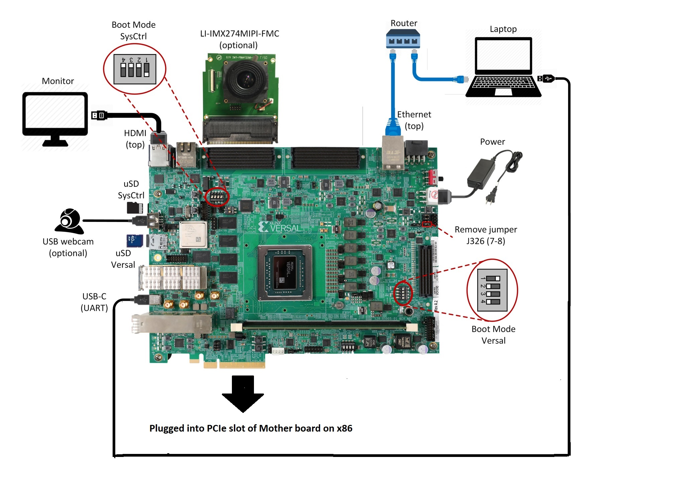

<table class="sphinxhide">
 <tr>
   <td align="center"><h1> Versal Prime -VMK180 Evaluation Kit TRD Tutorial</h1>
   </td>
 </tr>
 <tr>
 <td align="center"><h1>Setting up the Board and Application Deployment</h1>

 </td>
 </tr>
</table>

Setting up the Board and Application Deployment
===============================================

Introduction
------------

This document shows how to set up the board and run the VMK180 TRD application.

Setting up the Board
------------------------

### Flash the SD Card
  * Download  the `vmk180_trd_prebuilt_2022.1.zip` package, unzip and save it on your computer. Alternatively, Go through tutorials section to build `petalinux-sdimage.wic` locally.
  
  * To uncompress wic file use following command 

	```
	cd vmk180_trd_prebuilt_2022.1
	xz -d -v petalinux-sdimage.wic.xz
	```

	This generates a output file named
	`petalinux-sdimage.wic`.
  
  * Connect the microSD to your computer.

  * Download the [Balena Etcher tool](https://www.balena.io/etcher/) (recommended; available for Window, Linux, and 
  macOS) required to flash the SD card.

  * Follow the instructions in the tool and select the downloaded image to flash onto your microSD card. 

    

  * Eject the SD card from your computer.

    If you are looking for other OS specific tools to write the image to the SD card refer to [Setting up the SD Card Image](https://www.xilinx.com/products/som/kria/kv260-vision-starter-kit/kv260-getting-started/setting-up-the-sd-card-image.html)

### Hardware Setup:

Below diagram shows Board and hardware connections.

  


   
**Board jumper and switch settings**
  This is a onetime setup and the board should have been delivered to you with this default settings, but it is good to double check for the first time when you get the board.

   * Make sure you remove J326 (7-8) jumper.
   * Setup SYSCTRL Boot mode switch SW11 to (ON,OFF,OFF,OFF) from switch bits 1 to 4 as shown in the above picture.
   * Setup Versal Boot Mode switch SW1 to (ON,OFF,OFF,OFF) from switch bits 1 to 4 as shown in the above picture.

  * **microSD**: Insert the SD card into slot at Versal microSD slot (top).
  
	Make sure you have the SYSCTRL uSD card inserted in the slot (bottom) and card has the SYSCTRL image. For Latest version of SYSCTRL image, refer to [Beam Tool Wiki Page](https://xilinx-wiki.atlassian.net/wiki/spaces/A/pages/972914749/BEAM+Tool+for+VMK180+Evaluation+Kit )

  * **Monitor** : Before booting, connect a 1080P/4K monitor to the board via top HDMI port. 4K monitor is preferred to demonstrate at the maximum supported resolution.
	
	> **Note**: The design has been validated with Dell Flat panel(U2718Q) & Viewsonic (SS16024) monitors.
	
**FMC and Vadj settings**
   
   Before power on, install an  Leopard IMX274 MIPI FMC card to the FMCP1 slot (J51) as shown in the above figure.
   Perform the following steps to set the Vadj voltage rail to 1.2V using the BoardUI utility:
   
   * Download the BoardUI Utility from VMK180 Product Page: [BoardUI/ Board Interface Test](https://www.xilinx.com/support/documentation-navigation/see-all-versions.html?xlnxproducttypes=Boards%20and%20Kits&xlnxdocumentid=XTP623 )
   * Extract the zip file and start the BoardUI tool. Make sure the USB-C cable is connected to your PC and the system controller Micro SD card is inserted.
   * In the BoardUI GUI, navigate to the FMC Boot Up tab following the red circles as shown in the below figure. Enter 1.2 in the Set On-Boot VADJ field and click the button next to it to save the value.
  
  
   

   * Power-cycle the board and navigate to the FMC Current tab. Click the Get VADJ_FMC Voltage button to read out the current voltage setting and confirm it matches the 1.2V set in the previous step.
   * Close the BoardUI utility.
  
  > **Note**: For the IMX274 MIPI FMC v1.1, Vadj voltage rail is required to be set to 1.5V instead of 1.2V.

  * **Serial console settings**: VMK180 comes with a USB-C connector for JTAG+UART, when connected three UART ports should be visible in Device Manager:

    * Versal UART0
    * Versal UART1 &
    * System Controller UART

  * Connect a USB-C cable to the USB-UART connector. In the terminal emulator choose Versal UART0 and use the following settings:
  
    * Baud Rate: 115200
    * Data: 8 bit
    * Parity: None
    * Stop: 1 bit
    * Flow Control: None

  
  * **Network connection**:

    Connect the Ethernet cable to your local network with DHCP enabled to run Jupyter Notebooks

### Power on the board, and boot the Linux image.
   
   Follow these steps to boot the board into Linux:
  * Ensure all steps under the section ‘Board jumper and switch settings’ are verified.
	
  * Insert the prepared micro SD card into the Versal SD card slot (refer to the image VMK180 Board Setup)
	
  * Make physical connections to ethernet, HDMI, UART, webcam and power as shown in the image.
	
  * Turn ON power switch SW13.
	
  * On Versal UART0 terminal, we would see the Versal device booting from the micro SD card starting with the message “Xilinx Versal Platform Loader and Manager”
	
  * In about 60 seconds boot is complete. Observe the Linux prompt root@vmk180-trd and autostart of JupyterLab server as shown in the example below:
	

 ```
 root@vmk180-trd:~#
[   70.233800] start-jupyter.sh[541]: [I 2022-07-15 09:10:50.122 ServerApp] jupyterlab | extension was successfully linked.
[   77.468923] start-jupyter.sh[541]: [I 2022-07-15 09:10:50.283 LabApp] JupyterLab extension loaded from /usr/lib/python3.9/site-packages/jupyterlab
[   77.469109] start-jupyter.sh[541]: [I 2022-07-15 09:10:50.283 LabApp] JupyterLab application directory is /usr/share/jupyter/lab
[   77.469224] start-jupyter.sh[541]: [I 2022-07-15 09:10:50.300 ServerApp] jupyterlab | extension was successfully loaded.
[   77.469319] start-jupyter.sh[541]: [I 2022-07-15 09:10:50.303 ServerApp] Serving notebooks from local directory: /usr/share/notebooks
[   77.469411] start-jupyter.sh[541]: [I 2022-07-15 09:10:50.303 ServerApp] Jupyter Server 1.13.5 is running at:
[   77.469509] start-jupyter.sh[541]: [I 2022-07-15 09:10:50.303 ServerApp] http://172.19.1.246/lab?token=246f08cec92a774115fe9ca6f3ba5d151deba1ae05aeb993
[   77.469600] start-jupyter.sh[541]: [I 2022-07-15 09:10:50.303 ServerApp]  or http://127.0.0.1:8888/lab?token=246f08cec92a774115fe9ca6f3ba5d151deba1ae05aeb993
[   77.469701] start-jupyter.sh[541]: [I 2022-07-15 09:10:50.303 ServerApp] Use Control-C to stop this server and shut down all kernels (twice to skip confirmation).
[   77.469810] start-jupyter.sh[541]: [C 2022-07-15 09:10:50.322 ServerApp]
[   77.469901] start-jupyter.sh[541]:     
[   77.469989] start-jupyter.sh[541]:     To access the server, open this file in a browser:
[   77.470086] start-jupyter.sh[541]:         file:///home/root/.local/share/jupyter/runtime/jpserver-541-open.html
[   77.470213] start-jupyter.sh[541]:     Or copy and paste one of these URLs:
[   77.470311] start-jupyter.sh[541]:         http://172.19.1.246:8888/lab?token=246f08cec92a774115fe9ca6f3ba5d151deba1ae05aeb993
[   77.470400] start-jupyter.sh[541]:      or http://127.0.0.1:8888/lab?token=246f08cec92a774115fe9ca6f3ba5d151deba1ae05aeb993
  
 ```
   Follow these steps to connect to the jupyter-server using Chrome browser on the laptop.

 > **Note**:  This demo is tested with Chrome browser only.

  * Copy the generated URL with token on the prompt of Versal target and paste it to the browser address bar of the laptop, for example:

```
http://172.19.1.246:8888/?token=c46d443a39d2648046afdbb9bc5821177ab7cd386c218103

```

  > **Note**: If for any reason target fails to grab an IP address from the network, Jupyter server would fail to issue an URL. In such a case user is recommended to fix the IP address and restart the jupyter server as shown below:

```

systemctl stop jupyter-setup
systemctl start jupyter-setup

```
To look up the jupyter server IP address and token on the target, run:

```
journalctl -u jupyter-setup

```
Copy the generated URL with token on the prompt of Versal target and paste it to the browser address bar of the laptop, for example:

```

http://192.168.1.77:8888/?token=06cfb958c61eb0581bb759f40e3a4c3a6252cef3b7075449

```

> **Note**: If you do not see any URL for the Juputer Notebook, you may have to setup a private network. Likely, DHCP is not be available to allot the board an IP address. To setup a private network and start the notebook follow the instruction below.


### Setting up a private network

In case of a private network, user can assign a static address within
the subnet of the host machine.

**Setting up a private network with target board and the host machine for Windows users:**

* Ensure a direct connection between the windows host machine and the target
  board using an ethernet cable as shown in the Hardware Setup section.

* In windows, run command prompt as an admisntrator

```
     Press Windows+R to open the “Run” box.
     Type “cmd” into the box.
     press Ctrl+Shift+Enter to run the command as an administrator
```

* Run ipconfig on the windows machine to list available ethernet adapters and
  set a static private ip

 ```

     # A sample output after executing ipconfig
     # notice interface "Ethernet" has an auto address assigned with no Default Gateway

     ipconfig

     Ethernet adapter Ethernet:

        Connection-specific DNS Suffix  . :
        Link-local IPv6 Address . . . . . : fe80::1d8d:ac40:ff9b:8d1%21
        Autoconfiguration IPv4 Address. . : 169.254.8.209
        Subnet Mask . . . . . . . . . . . : 255.255.0.0
        Default Gateway . . . . . . . . . :

     # Set static ip address
     netsh interface ip set address name="YOUR INTERFACE NAME" static "IP_ADDRESS" "SUBNET_MASK"

     # Example
     netsh interface ip set address name="Ethernet" static 10.0.0.1 255.255.255.0
```

* Ensure to boot the target board (VCK190) into Linux

* Set a private ip address for the target within the subnet of host machine and
  verify connectivity.

  ```

     ifconfig eth0 10.0.0.2 netmask 255.255.255.0

     # Perform a ping test to the host form the target
     ping -c 3 10.0.0.1
  ```
  
	**Setting up a private network with target board and the host machine for Linux users**

* Make a direct connection between the Linux host machine and the target board using an ethernet cable

* Run ifconfig on the Linux machine to list available ethernet adapters and set a static private ip

	```

     # Example to set an ip 10.0.0.1 to ethernet interface enp2s0:
     sudo ifconfig enp2s0 10.0.0.1 netmask 255.255.255.0
	```

* Ensure to boot the target board (VCK190) into Linux

* Set a private ip address for the target within the subnet of host machine and
  verify connectivity.

  ```

     ifconfig eth0 10.0.0.2 netmask 255.255.255.0

     # Perform a ping test to the host form the target
     ping -c 3 10.0.0.1
  ```

* To start Jupyter Notebook run

```
systemctl stop jupyter-setup
systemctl start jupyter-setup
```

Run the Application
----------------------

### Run the Jupyter Notebooks

 This TRD includes the following jupyter notebooks:

1. **vmk180-trd-nb1.ipynb**: Demonstrates how to configure a V4L2 device or video raw file from host machine through pcie, processes media content through 2D filter(optional) and transfers processed content to host via PCIe (or) display the content on hdmi monitor.
	>  **NOTE** : For PCIe use-cases, host application to be run prior to running notebook (i.e. vmk180-trd-nb1) on end point. the steps to run host application are documented in the following section.
2. **vmk180-trd-nb2.ipynb**:  Demonstrates how to capture video from a MIPI device, processes it through 2D convolution filter accelerator and display the output on a monitor using a DRM/KMS display device. This notebook uses the GStreamer multimedia framework. In addition, the memory bandwidth is measured and plotted in a parallel notebook.
3. **vmk180-trd-apm.ipynb**: Demonstrates how to plot the memory bandwidth while a video pipeline is running using the libxapm library with python bindings.
4. **vmk180-trd-cpu.ipynb**: Demonstrates how to plot the CPU usage while running applications and pipelines.
5. **vmk180-trd-power.ipynb**: Demonstrates how to plot power consumption of multiple voltage rails throughout the board.
  
to run the notebooks, follow the below steps:

1. On the left pane of the browser, 4 notebooks are available under the folder VMK180 TRD.
2. Double click to open the notebook
3. Select ‘Kernel’ → ‘Restart Kernel and Run All Cells’ (This will reset kernel and run's all cells sequentially) from the top menu bar to run the demo. Scroll down to the end of the notebook to see the video output.

	

4. Click the rectangular icon to interrupt the kernel and stop the video stream.

	

5. Select ‘Kernel’ → ‘Shutdown Kernel’ → close the notebook tab and move to the next notebook.

> **NOTE** : Please follow ''step 3 to step 5'', without this you may observe incorrect behavior while moving to different notebook. 


Host Machine Software setup
--------------------------------
 **Directory and file description**

Following are the list of directories in `pcie_host_package` directory.

  * **apps**: QDMA User space application to configure and control QDMA
  * **docs**: Documentation for the Xilinx QDMA Linux Driver	
  * **driver/src**: Provides interfaces to manage the PCIe device and exposes character driver interface to perform QDMA transfers
  * **driver/libqdma**: QDMA library to configure and control the QDMA IP	
  * **scripts**: Sample scripts for perform DMA operations
  * **Makefile**: Makefile to compile the driver
  * **pcie_app**: This application receives frame buffer data from host, processes it and sends frame buffer to host using QDMA driver


> **NOTE** : Make sure, the VMK180 board is powered on before booting the HOST machine to enumerate VMK180 board as PCIe endpoint device successfully

* Power on the HOST machine

* Execute following command on HOST machine's terminal to check If the Board is linking up:

```
lspci -vd 10ee:
```

On successful Linkup below entry appears followed by additional capabilities of VMK180 as endpoint: 
  
  ```
  03:00.0 RAM memory: Xilinx Corporation Device b03f
  ```

 If above entry is missing QDMA driver will not be able to recognized PCIe endpoint device. 
  
* if not already done, copy `pcie_host_package` directory to PCIe host machine. 

  
Updating the PCIe device ID (if needed)
---------------------------
Make sure that PCIe Device ID in the driver is matching to Device ID observed in linkup status. in above output `b03f` is device ID.

During the PCIe DMA IP customization in Vivado you can specify a PCIe Device ID. This Device ID must be recognized by the driver in order to properly identify the PCIe QDMA device. 

To Check/modify the PCIe Device ID in the driver, open the `$vmk180-trd/pcie_host_package/qdma/driver/src/pci_ids.h` file (line no : 320) from the driver source and search for the pcie_device_id struct. 
This struct defines the PCIe Device IDs that are recognized by the driver in the following format: 

```
{PCI_DEVICE (0x10ee, 0xb03f),}, 

```

Add, remove, or modify the PCIe Device IDs in this struct. The PCIe DMA driver will only recognize device IDs identified in this struct as PCIe QDMA devices. User can also remove PCIe Device IDs that are not be used in their solution.
On every modification, the driver must be un-installed and recompiled, if compiled previously.

 For additional information refer https://xilinx.github.io/dma_ip_drivers/master/QDMA/linux-kernel/html/build.html

  * follow below steps to Install the QDMA driver
> **NOTE** : Root permissions will be required to install qdma driver. 

```
cd pcie_host_package/qdma
make 
 ```
 
* Install the QDMA driver
```
make install-mods

``` 

  * Configure the QDMA module paramters using following script:

```
./scripts/qdma_generate_conf_file.sh <bus_num> <num_pfs> <mode> <config_bar> <master_pf>` 

```
	
Ex: (Assuming PCIe BDF - 03:00.0)
	
```
./scripts/qdma_generate_conf_file.sh 0x03 1 0 1 0

```
 * For loading the driver, execute the following command: (This is required only First time, from next boot driver loads automatically)
```
modprobe qdma-pf
```
 * Setup and Enable Queues for H2C and C2H:  (Refer link in NOTE_1 for more details)
  Allocate the Queues to a function. QDMA IP supports maximum of 2048 queues. 
	By default, all functions have 0 queues assigned.
	qmax configuration parameter enables the user to update the number of queues for a PF. 
	This configuration parameter indicates “Maximum number of queues associated for the current pf”.

To set 1024 as qmax for PF0:

```
 echo 1024 > /sys/bus/pci/drivers/qdma-pf/$BDF/qdma/qmax
 
``` 

  * To Add a Queue:
	
```
 dma-ctl qdma<bbddf> q add idx <N> [mode <st|mm>] [dir <h2c|c2h|bi>] 
 
```
Ex: (Assuming PCIe BDF - 03:00.0)

```
dma-ctl qdma03000 q add idx 0 mode mm dir h2c
dma-ctl qdma03000 q add idx 1 mode mm dir c2h 

 ```

  * To start a Queue:

```
dma-ctl qdma<bbddf> q start idx <N> [dir <h2c|c2h|bi>]
```

Ex: (Assuming PCIe BDF - 03:00.0)

```
dma-ctl qdma03000 q start idx 0 dir h2c
dma-ctl qdma03000 q start idx 1 dir c2h  
   
```
	
  * Build host application:
  
```
cd pcie_app/

```
	
  * modify macros `H2C_DEVICE` , `C2H_DEVICE` , `REG_DEVICE_NAME` in pcie_host.cpp , using /dev/ nodes generated for  the pcie device based on its `Bus:Device:Function number`.
	
 Ex: Assuming PCIe BDF as `03:00.0` the above macros need to be set as:	
   * If H2C queue index is 0 device node is `/dev/qdma03000-MM-0`  (Queue index for H2C is set in above "Add a queue" step)
   * If C2H queue index is 1 device node is `/dev/qdma03000-MM-1`  (Queue index for C2H is set in above "Add a queue" step)
		

   REG_DEVICE_NAME is `/sys/bus/pci/devices/0000:03:00.0/resource0`

   * Modify pcie_app/app1.pro line no 35 and 39 for opencv library path and opencv include path before compilation

   * set `QMAKE_PATH` to installed QT qmake path

```
export QMAKE_PATH=/opt/Qt5.9/5.9/gcc_64/bin/qmake`
```

compile application:
``` 
./do_compile.sh

```

 Generate of Raw video Input file.
------------------------------------

> **Note**:: : Ensure that Gstreamer packages installed on the Linux PC. If using Ubuntu distribution, ensure that the version is atleast 16.04.

1. Download VP9 encoded sample file such as [Big_Buck_Bunny](https://upload.wikimedia.org/wikipedia/commons/transcoded/c/c0/Big_Buck_Bunny_4K.webm/Big_Buck_Bunny_4K.webm.480p.vp9.webm)

2. Run following GST command to create 3840x2160 resolution raw file with YUY2 format with 30fps

```
gst-launch-1.0 filesrc location=<file_path>/Big_Buck_Bunny_4K.webm.480p.vp9.webm ! decodebin ! queue ! videoconvert ! videoscale ! videorate ! video/x-raw, width=3840, height=2160, format=YUY2, framerate=30/1 ! filesink location=<file_path>/4k30.yuv
```

* Run following GST command to create 1920x1080 resolution raw file with YUY2 format with 30fps

```
gst-launch-1.0 filesrc location=<file_path>/Big_Buck_Bunny_4K.webm.480p.vp9.webm ! decodebin ! queue ! videoconvert ! videoscale ! videorate ! video/x-raw, width=1920, height=1080, format=YUY2, framerate=30/1 ! filesink location=<file_path>/1080p30.yuv
```
		
## Run Host and EP applications

Steps to run Host application :
-------------------------------

> **Note:**  Make sure, HOST application is launched before starting EP application.

> As described in the previous sections host application provides control information to the Endpoint to run any usecase. 
 
 Here are list of control information passed to endpoint :-
 ```
	-- Usecase to run.
	-- Resolution.
	-- Filter type.
	-- FPS (Default 30fps).
	-- Rawvideofile (with abosolute path of video file to play).
 ```
 
This example demonstrates Usecase-1(MIPI --> 2D Image Processing --> Appsink(PCIe))
1. First run Host Machine Software setup steps,Then execute pcie_host_app application as following.
	
	```	
		# ./pcie_host_app
	```


2. From the six usecases select any one of the usecase or 4 to quit application.
	```
		# ./pcie_host_app
		Enter 1 to run  : MIPI-->filter2d-->pciesink--> displayonhost
		Enter 2 to run  : MIPI-->pciesink--> displayonhost
		Enter 3 to run  : RawVideofilefromHost-->pciesrc-->filter2d-->pciesink-->displayonhost
		Enter 4 to run  : RawVideofilefromHost--> pciesrc-->pciesink-->displayonhost
		Enter 5 to run  : RawVideofilefromHost--> pciesrc-->filter2d-->kmssink
		Enter 6 to run  : RawVideofilefromHost--> pciesrc-->kmssink
		Enter 7 to 	: Exit application
		Enter your choice:1

	```

3. Select desired resolution (Enter 1 or 2 ):
	```
		# ./pcie_host_app 
		Enter 1 to run  : MIPI-->filter2d-->pciesink--> displayonhost
		Enter 2 to run  : MIPI-->pciesink--> displayonhost
		Enter 3 to run  : RawVideofilefromHost-->pciesrc-->filter2d-->pciesink-->displayonhost
		Enter 4 to run  : RawVideofilefromHost--> pciesrc-->pciesink-->displayonhost
		Enter 5 to run  : RawVideofilefromHost--> pciesrc-->filter2d-->kmssink
		Enter 6 to run  : RawVideofilefromHost--> pciesrc-->kmssink
		Enter 7 to 	: Exit application
		Enter your choice:1
		select the resolution 
		1. 3840x2160
		2. 1920x1080
		Enter your choice:1
	```


4. From below table select anyone filter-type   (Enter 0 - 10)  

	```
		# ./pcie_host_app
		Enter 1 to run  : MIPI-->filter2d-->pciesink--> displayonhost
		Enter 2 to run  : MIPI-->pciesink--> displayonhost
		Enter 3 to run  : RawVideofilefromHost-->pciesrc-->filter2d-->pciesink-->displayonhost
		Enter 4 to run  : RawVideofilefromHost--> pciesrc-->pciesink-->displayonhost
		Enter 5 to run  : RawVideofilefromHost--> pciesrc-->filter2d-->kmssink
		Enter 6 to run  : RawVideofilefromHost--> pciesrc-->kmssink
		Enter 7 to 	: Exit application
		Enter your choice:1
		select the resolution 
		1. 3840x2160
		2. 1920x1080
		Enter your choice:1  
		Enter filter type value 0-10:9
	
	```


5. When application prompts below prints launch (vmk180-trd-nb1.ipynb) jupyter notebook. 

> Note : Set 'res' variable in vmk180-trd-nb1.ipynb to appropriate value to ensure resolution is same at host and end point.

	```
	
		Please run 'vmk180-trd-nb1.ipynb' jupyter notebook from endpoint (To launch endpoint application)
		To quit usecase, hit <q+enter> from host 
	
	```


> **Note:**  Only for `MIPI` usecase , hit <q+enter> from host to quit.


From Usecase-3, User is expected to pass rawvideo file as an additional parameter.

6. Enter input filename with absolute path to play and depending on rawvideo file size usecases stops  
	```
	 # ./pcie_host_app 
	 	Enter 1 to run  : MIPI-->filter2d-->pciesink--> displayonhost
	   	Enter 2 to run  : MIPI-->pciesink--> displayonhost
		Enter 3 to run  : RawVideofilefromHost-->pciesrc-->filter2d-->pciesink-->displayonhost
		Enter 4 to run  : RawVideofilefromHost--> pciesrc-->pciesink-->displayonhost
		Enter 5 to run  : RawVideofilefromHost--> pciesrc-->filter2d-->kmssink
		Enter 6 to run  : RawVideofilefromHost--> pciesrc-->kmssink
		Enter 7 to 	: Exit application
		Enter your choice : 3
	   	select the resolution
	   	1. 3840x2160
	   	2. 1920x1080
	   	Enter your choice:2
	   	Enter input filename with path to transfer: ~/xxx.yuv
	```
	
**To execute end-point application:** 

1. Launch vmk180-trd-nb1.ipynb jupyter notebook. (For MIPI use case modify 'res' variable same as one selected at host application). 

> **Note:** Endpoint application exits after running the usecase, Hence restart `vmk180-trd-nb1.ipynb` jupyter notebook to relaunch the endpoint 	   application.

Following Table lists the supported filter configuration in the design.

   |Filter_type |Filter name|
   |----|----|
   |0 |Blur filter|
   |1 |Edge filter|
   |2 |Horizontal Edge filter| 
   |3 |Vertical Edge filter|      
   |4 |Emboss filter| 
   |5 |HGRAD filter|      
   |6 |VGRAD filter| 
   |7 |Identity filter|      
   |8 |Sharpe filter| 
   |9 |Horizontal Sobel filter| 
   |10 |Vertical Sobel filter|
   
A filter version of big buck bunny video will start playing on DP monitor.

**Next Steps**
* Go back to the [VMK180 TRD design start page](../platform1_landing.md)

**License**

Licensed under the Apache License, Version 2.0 (the "License"); you may not use this file except in compliance with the License.

You may obtain a copy of the License at
[http://www.apache.org/licenses/LICENSE-2.0](http://www.apache.org/licenses/LICENSE-2.0)

Unless required by applicable law or agreed to in writing, software distributed under the License is distributed on an "AS IS" BASIS, WITHOUT WARRANTIES OR CONDITIONS OF ANY KIND, either express or implied. See the License for the specific language governing permissions and limitations under the License.

<p align="center">Copyright&copy; 2021 Xilinx</p>
