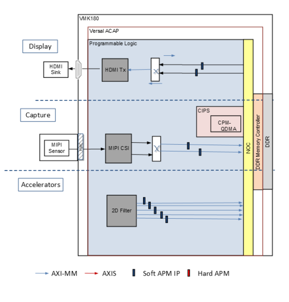



Hardware Architecture of the Platform
======================================

Introduction
------------

This section describes the design implemented on Processing System (PS) and Programmable Logic (PL) on the VMK180 board , LIIMX274MIPI-FMC image sensor daughter card and x86 host machine (root complex).

The following figure shows the top level hardware architecture of the reference design.

 
At a high level, the design comprises of three pipelines

Capture/Input pipeline: This comprises of pipelines through which video data are captured.

* MIPI CSI-2 capture pipeline (PL)
* Media file from x86 host  

Display/Output pipeline: This comprises of pipelines through which video data are outputted.

* DisplayPort pipeline (PL)

Video Accelerator/processing pipeline: This comprises of mem to mem pipelines through which video data is processed/decrypted.

* The 2D Filter accelerator (PL) integrated into the platform using Vitis.
* VP9 Decoder and demux (PS)

**Note:**  The PS interconnects in the figure are conceptual.

Capture
------------

A capture pipeline receives video frames and writes it into memory.Video frames are received from :

a) Single sensor MIPI CSI-2 camera 
b) x86 host

a) If the input source is a single sensor MIPI CSI-2 receiver then the following figure describes the components present.

.. image:: ../../media/CSI_Video_Capture_Pipeline.png
   :width: 800

This pipeline consists of six components, four of which are controlled by the APU via an AXI4-Lite-based register interface, one is controlled by the APU via an I2C register interface, and one is configured statically. 

* The Sony IMX274 sensor is a 1/2.5 inch CMOS digital image sensor with an active imaging pixel array of 3864H x 2196V. The image sensor is controlled by an I2C interface using an AXI I2C controller in the PL. It is mounted on an FMC daughter card and has a MIPI output interface that is connected to the MIPI CSI-2 RX subsystem inside the PL. For more information, see the LIIMX274 MIPI FMC data sheet.

* The MIPI CSI-2 receiver subsystem (CSI RX) includes a MIPI D-PHY core that connects four data lanes and one clock lane to the sensor on the FMC card. It implements a CSI-2 receive interface according to the MIPI CSI-2 standard v2.0 with underlying MIPI D-PHY standard v1.2. The subsystem captures images from the IMX274 sensor in RAW10 format and outputs AXI4-Stream video data. For more information, see the MIPI CSI-2 Receiver Subsystem Product Guide (`PG232 <https://www.xilinx.com/support/documentation/ip_documentation/mipi_csi2_rx_subsystem/v5_0/pg232-mipi-csi2-rx.pdf>`_).

* The AXI subset converter is a statically-configured IP core that converts the raw 10-bit (RAW10) AXI4-Stream input data to raw 8-bit (RAW8) AXI4-Stream output data by truncating the two least significant bits (LSB) of each data word.

* The Image Single Processing IP available in the Vitis vision librarires (https://github.com/Xilinx/Vitis_Libraries/tree/master/vision/L1) implements the following functions.
  * The Badpixelcorrection module removes the defective pixels in the image as an image sensor may have a certain number of defective/bad pixels that may be the result of manufacturing faults or variations in pixel voltage levels based on temperature or exposure. 
	
  * The Gain control module improves the overall brightness of the input image by applying a multiplicative gain (weight) for red and blue channel to the input bayerized image.
  
  * The Demosaicing module converts a single plane Bayer pattern output, from the digital camera sensors to a color image.
  
  * The histogram module computes the histogram of given input image. The normalization module changes the range of pixel intensity values. Both modules are used to improve the contrast in the image. See https://xilinx.github.io/Vitis_Libraries/vision/api-reference.html#vitis-vision-libraryfunctions for more details

  * The ISP IP receives the RAW AXI4-Stream input data and interpolates the missing color
    components for every pixel to generate a 24-bit, 8 bits per pixel (8 bpc) RGB output image
    transported via AXI4-Stream. At 4 ppc, the AXIS width is 96-bit. A GPIO from the PS is
    used to reset the IP between resolution changes.

* The video processing subsystem (VPSS) is a collection of video processing IP sub-cores. This instance uses the color space converter (CSC) configuration to perform color correction tasks including contrast, brightness, and gain control of red/green/blue colors . The CSC takes AXI3-Stream input data and produces AXI4-Stream output data, both in 24-bit RGB format. A GPIO is used to reset the subsystem between resolution changes. For more information, see the Video Processing Subsystem Product Guide (`PG231 <https://www.xilinx.com/support/documentation/ip_documentation/v_proc_ss/v2_3/pg231-v-proc-ss.pdf>`_).

* The video frame buffer takes YUV 4:2:0 sub-sampled AXI4-Stream input data and converts it to the memory mapped AXI4 format, which is written to memory as 12-bit packed YUYV. The memory mapped AXI interface is connected to the system DDR via the NoC. For each video frame transfer, an interrupt is generated. A GPIO is used to reset the IP between resolution changes.

All of the IPs in this pipeline are configured to transport 4 ppc, enabling up to 2160p60 performance.

b) If the media file is transfered from host x86 to the VMK180 evaluation board (endpoint) through the PCIe Queue DMA (QDMA).

Then the design uses the CPM PCI Express (PCIe) Endpoint Hard block in an Gen3 x8 configuration along with QDMA for data transfers between the host system memory and the endpoint.

The QDMA provides protocol conversion between PCIe transaction layer packets (TLPs) and AXI transactions. The DMA cores are used for data transfer between the programmable logic (PL) to the host.DMA transfers data between host and the memory controller (DDR). The CPM contains AXI Bridge core for AXI-to-host communication. The downstream AXI4-Lite slaves include user-space registers, which are responsible for a hand-shaking mechanism between the host and the endpoint.

Display
----------

Display pipeline fetches video frames from DDR memory and displays it onto HDMI monitor connected to :  

a) VMK180 Evaluation Board 
b) X86 host

a) The HDMI TX display pipeline (in the PL) is controlled by the video frame buffer read, which fetches the video layer from memory and sends the data to the HDMI TX subsystem. The HDMI TX subsystem processes data and sends it out to an external display device. The HDMI
transmitter display pipeline is shown in the following figure.

.. image:: ../../media/HDMI_Transmitter_Display_Pipeline.png
   :width: 800
   
As shown in the figure, the pipeline comprises three main components, each of them controlled by the APU via an AXI4-Lite base register interface. These components are described in the following paragraphs.

* The video frame buffer read IP provides high-bandwidth direct memory access between memory and AXI4-Stream video type target peripherals, which support the AXI4-Stream video protocol. IP takes memory mapped AXI4 input data from DDR and converts it to AXI4-Stream format. The output is connected to HDMI transmitter subsystem. For each video frame transfer, an interrupt is generated. A GPIO is used to reset the core between resolution changes. For more information, see the Video Frame Buffer Read and Video Frame Buffer Write LogiCORE IP Product Guide (`PG278 <https://www.xilinx.com/support/documentation/ip_documentation/v_frmbuf/v2_2/pg278-v-frmbuf.pdf>`_).

* The HDMI transmitter subsystem (HDMI TX) interfaces with PHY layers and provides HDMI encoding functionality. The subsystem is a hierarchical IP that bundles a collection of HDMI TXrelated IP sub-cores and outputs them as a single IP. The subsystem generates an HDMI stream from the incoming AXI4-Stream video data and sends the generated TMDS data to the video PHY layer. For more information, see the HDMI 1.4/2.0 Transmitter Subsystem Product Guide (`PG235 <https://www.xilinx.com/support/documentation/ip_documentation/v_hdmi_tx_ss/v3_1/pg235-v-hdmi-tx-ss.pdf>`_).

* The HDMI GT controller (PHY) enables plug-and-play connectivity with video transmit or receive subsystems. The interface between the media access control (MAC) and physical (PHY) layers are standardized to enable ease of use in accessing shared gigabit-transceiver (GT) resources. The data recovery unit (DRU) supports lower line rates for the HDMI protocol. An AXI4-Lite register interface is provided to enable dynamic accesses of transceiver controls/status. For more information, see the HDMI GT Controller LogiCORE IP Product Guide (`PG334 <https://www.xilinx.com/support/documentation/ip_documentation/hdmi_gt_controller/v1_0/pg334-hdmi-gt-controller.pdf>_`).

b)For the HDMI dispay on host monitor the design uses the CPM PCI Express (PCIe) Endpoint Hard block in an Gen3 x8 configuration along with QDMA for data transfers between the endpoint and the host system memory . The QDMA provides protocol conversion between PCIe transaction layer packets (TLPs) and AXI transactions. The DMA cores are used for data transfer between the memory controller (DDR) in PL to the host memory . AXI Bridge core in CPM is used for AXI-to-host communication. AXI4-Lite slaves has the user space registers which are used for hand shaking between host and endpoint.

 
  Clocks
----------

**PS Clocks**

The following table lists the clock frequencies of key PS components.

.. csv-table:: **Table 1: Key Component Clock Frequencies**
	:file: ../../../tables/clock_freq.csv
	:widths: 30, 70
	:header-rows: 1

**System Clocks**

The following table identifies the main clocks of the PL design, their source, their clock frequency, and their function.

.. csv-table:: **Table 2: System Clocks**
	:file: ../../../tables/system_clocks.csv
	:widths: 30, 30, 30, 70
	:header-rows: 1

The PL0 clock is provided by the PPLL inside the PMC domain and is used as the reference input clock for the clocking wizard instance inside the PL. This clock does not drive any loads directly. A clocking wizard instance is used to deskew the clock and to provide threephase-aligned output clocks, Clk_out1, Clk_out2, and Clk_out3.

The Clk_out2 clock is generated by the clocking wizard instance. It is used to drive most of the AXI4-Lite control interfaces in the PL. AXI4-Lite interfaces are typically used in the control path to configure IP registers and, consequently, can operate at a lower frequency than datapath interfaces.

The Clk_out1 clock is generated by the clocking wizard instance. It is used to drive the memory mapped AXI interfaces of the capture pipelines in the PL. These interfaces are in the datapath and, consequently, are needed to support the maximum performance of 2160p60, which roughly corresponds to a 150 MHz clock at 4 ppc. The HLS-based IP core interfaces and Vitis generated modules are based on Clk_out1 rather than Clk_100MHz (HLS IPs typically share a common input clock between control and data interfaces).

Hardware Architecture of the host to end point architecture
----------------------------------------------------------------

In the host to endpoint direction, the QDMA block moves data from the host memory to the PLside through the PCIe and then writes the data to the memory controller (DDR) via the NOC. Then, the 2D filter accelerator IP reads data from the DDR, performs filtering, and writes it back again to memory. Finally, in the endpoint to host direction, the QDMA reads the DDR via the NOC interface and writes to the host system memory through the PCIe. The following figure shows a detailed hardware block diagram.

The submodules described in this section are :

## Network On Chip

Versal™ ACAP devices are designed around a network on chip (NoC) interconnect, which provides high-bandwidth communication between different areas of the device. In the base platform, the NoC is used for the following:

  * Connects the CPM module to DDR memory, allowing the host server to have DMA to the DDR memory controllers.
  * Allows the Arm®-A72 processor within the processor subsystem (PS) to connect to the DDR memory.
  * Allows the platform management controller (PMC) to communicate to or from the PCIe and the DDR memory.
  * Allows all the CPM and PS Cortex-A72 masters to access the programmable logic (PL) peripherals.
  * Exposes the platform interfaces to connect the accelerator to the base platform, which allows the accelerators to access the DDR      memory.

## DDR Memory Controllers

The VM1802 device contains four hardened DDR memory controllers (MCs) that are accessed via the NoC. NoC configuration into the MCs can support individual access to each of the four MCs, or alternatively, can support MC interleaving in either pairs or as a group of four. This NoC interleaving ability makes interleaved MCs appear as a single block of memory.

As illustrated in the above figure, the platform design configures all four MCs as a single interleaved bank of memory that in theory can provide up to ~60 Gbytes/second of bandwidth. This memory structure was chosen as a starting point primarily because it is required to support maximum accelerator performance.

## CCIX PCIe Module

The CCIX PCIe module (CPM) is the CCIX and the PCIe module, including DMA (QDMA), that is hardened in Versal ACAP devices.

The CPM is configured for Gen3 x8 operation, connecting to the eight adjacent GTY transceivers via the XPIPE dedicated interface as illustrated in the above figure. The PCIe Gen3 x8 transfers data between the accelerator card. The QDMA supports memory mapped AXI operation over the Versal ACAP NoC to allow the host server initiated writes and reads to and from the hardened
DDR MCs. This operation is typically known as the QDMA memory mapped operation.

## Control Interfaces and Processing System

The control interfaces and processing system (CIPS in the Versal ACAP device contains highperformance Arm Cortex-A72 processors. On-chip and cache memory is included along with a suite of hardened communication peripherals.

A Cortex-A72 device is employed and is given access to 2 GBytes of DDR RAM. This 2 Gbytes of address space is intended solely for the use of the Cortex-A72. Embedded Linux is run on the Cortex-A72, and runs an application to offload the filtering part using XRT by performing scheduling of customer accelerator functions and monitoring for accelerator function completion.

Of the provided PS peripherals, the peripherals required for the accelerator card are as follows:

* JTAG/UART: for connection to the Vivado® lab tools (e.g., for bitstream download and debug) and to the on-card satellite controller
* I2C: for connection to board peripherals, such as the onboard fan and programmable clock sources .

## Programmable Logic Infrastructure

The PL logic is shown to stem from the NoC instance . From these NoC connections, the PL peripherals are either directly connected or connected via the intermediate SmartConnect.

**Next Steps**

.. toctree::
   :maxdepth: 1

   hw_arch_accel.md

**License**

Licensed under the Apache License, Version 2.0 (the "License"); you may not use this file except in compliance with the License.

You may obtain a copy of the License at
[http://www.apache.org/licenses/LICENSE-2.0](http://www.apache.org/licenses/LICENSE-2.0)

Unless required by applicable law or agreed to in writing, software distributed under the License is distributed on an "AS IS" BASIS, WITHOUT WARRANTIES OR CONDITIONS OF ANY KIND, either express or implied. See the License for the specific language governing permissions and limitations under the License.

