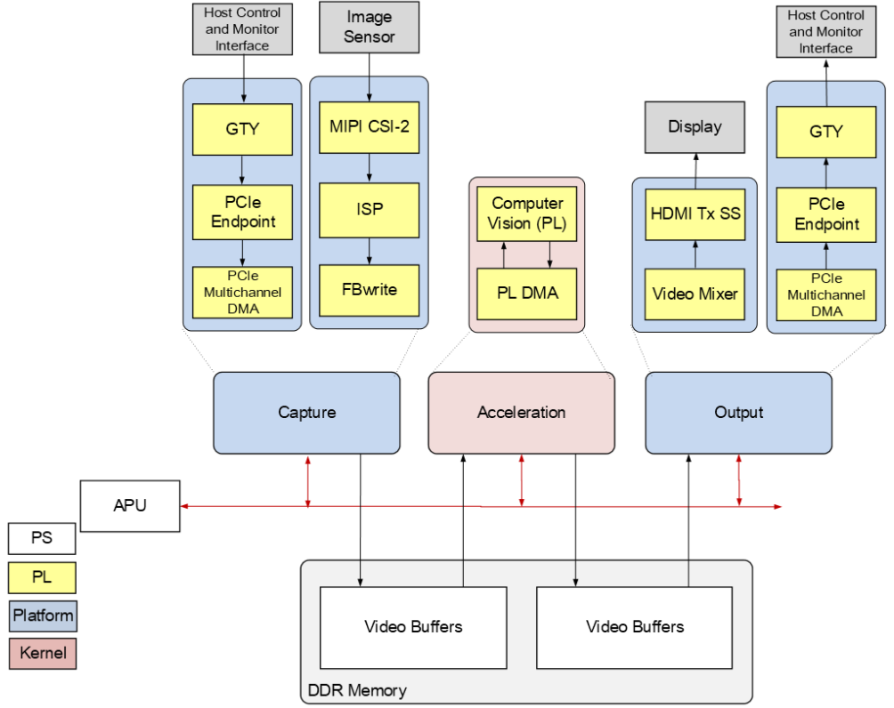
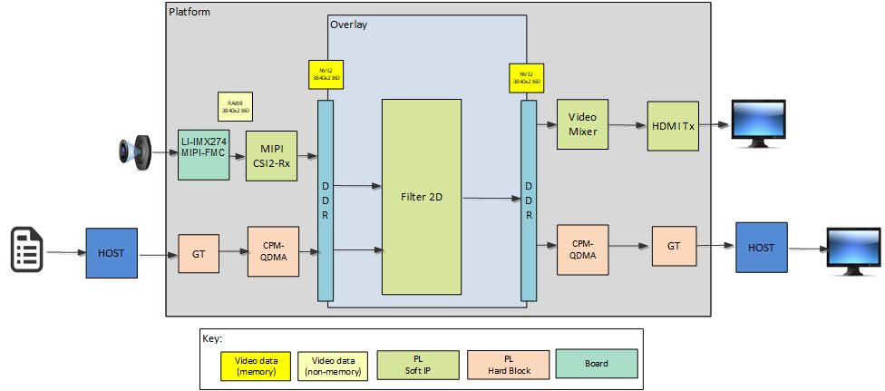

<table class="sphinxhide">
 <tr>
   <td align="center"><h1> VMK180 TRD Tutorial</h1>
   </td>
 </tr>
 <tr>
 <td align="center"><h1> Design Overview </h1>

 </td>
 </tr>
</table>

Design Overview
===============

Introduction
------------

The VMK180 TRD application design is built on VMK180 Evaluation Kit and provides a framework for building and customizing video platforms . The design has a platform and integrated accelerator functions.Programmable logic (PL) is used for the accelerator development. The platform supports capture from MIPI single sensor device and PCIe video Input. The output can be displayed on HDMI monitor or sent to a host machine over PCIe.

A user programmable 2D filter in PL example Processing functions can be run on this platform

The following figure shows the various pipelines supported by the design.

The APU in the Processing Sytem (PS) consists of two Arm&reg; Cortex&reg;-A72 cores and is configured to run in symmetric multi-processing (SMP) Linux mode in the  design. The application running on Linux is responsible for configuring and controlling the video pipeline and accelerators using Jupyter notebooks.

The APU application controls the video data paths implemented in the PL:

* Capture/Input pipeline capturing video frames into DDR memory from an image sensor connected via MIPI CSI-2 RX through the PL or receives video frames into the DDR memory from CPM-QDMA host to card (H2C) Channel.

* Processing/Accelerator/Memory-to-memory (M2M) pipeline implementing 2D Filter. Captured video frames are read from DDR memory, processed by the filter, and then written back to memory.

* An Display/Output pipeline reads video frames from DDR memory and sends the frames to a sink. In this case the sink is a HDMI display or to the host via QDMA's card to host (C2H) channel.
  

The following figure shows an example end-to-end pipeline which could be a single image sensor as the video source, filter 2D for processing. The processed frames are either  displayed via HDMI port or via monitor on PCIe Host. The video format in the figure is the output format on each block. Details are described in the [Hardware Architecture document](hw_arch_platform.md).

Design Components
------------------

 
<b>Hardware components</b>

  * [VMK180 Evaluation Kit](https://www.xilinx.com/products/boards-and-kits/vmk180.html)
  * [Leopard IMX274 MIPI FMC Card](https://www.leopardimaging.com/product/csi-2-mipi-modules-i-pex/li-imx274mipi-fmc)
  * A x86 server class host machine
  * A monitor with HDMI input supporting upto 4kp60 & Display port upto 4k30
  

 
<b>Interfaces and IP</b>

* Video inputs
   * MIPI CSI-2 Rx
* Video outputs
   * HDMI
   * PCIe/Display Port on Host
* Video processing
   * PL based 2D filter Accelerator
* Auxiliary Peripherals
   * SD
   * I2C
   * UART
   * Ethernet
   * General purpose I/O (GPIO)

 
<b>Software components</b>

* Operating system
   * APU: SMP Linux
* Linux kernel subsystems
   * Video source: Video4 Linux (V4L2)
   * Display: Direct Rendering Manager (DRM)/Kernel Mode Setting (KMS)
   * [Xilinx run-time (XRT)](https://www.xilinx.com/products/design-tools/vitis/xrt.html)
* Linux user space frameworks
   * Jupyter
   * [Vitis Video Analytics SDK](https://www.xilinx.com/products/design-tools/vitis/vvas.html) 
   
* Host components
  * QT - QT version 5.9.0
  * OpenCV - OpenCV version 4.6.0-dev
  * [Xilinx QDMA Driver](https://xilinx.github.io/dma_ip_drivers/2019.1/linux-kernel/html/index.html)

 

 

 
<b>Resolution and Format Supported</b>

* Resolutions
   * MIPI: 1080p60,2160p60
   * PCIe Use-Cases: 1080p30, 2160p30
  
* Pixel format
   * YUVY8 
   * YUYV
 

&nbsp;

**Next Steps**

* [Setting up the Board and Application Deployment](app_deployment.md)
* Go back to the [VMK180 TRD design start page](../platform1_landing.md)

**References**

* VMK180 Evaluation Board User Guide ([UG1411](https://www.xilinx.com/support/documentation/boards_and_kits/vmk180/ug1411-vmk180-eval-bd.pdf))
* Versal Architecture and Product Data Sheet: Overview([DS950]( https://www.xilinx.com/support/documentation/data_sheets/ds950-versal-overview.pdf))

**License**

Licensed under the Apache License, Version 2.0 (the "License"); you may not use this file except in compliance with the License.

You may obtain a copy of the License at
[http://www.apache.org/licenses/LICENSE-2.0](http://www.apache.org/licenses/LICENSE-2.0)

Unless required by applicable law or agreed to in writing, software distributed under the License is distributed on an "AS IS" BASIS, WITHOUT WARRANTIES OR CONDITIONS OF ANY KIND, either express or implied. See the License for the specific language governing permissions and limitations under the License.

Copyright&copy; 2022 Xilinx

